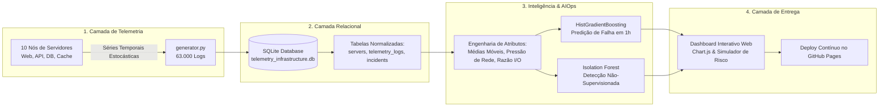

# 🚀 AIOps & Cyber-Telemetry Analytics: Detecção de Anomalias e Predição de Falhas em Infraestrutura Crítica

<p align="center">
  <a href="https://jhonnybsilva.github.io/aiops-telemetry-anomaly-detection/">
    <strong>🌐 Clique aqui para acessar o Dashboard Interativo Online (GitHub Pages)</strong>
  </a>
</p>

<p align="center">
  
  
  
  
  
  
</p>

---

## 📌 Visão Geral do Projeto

Este projeto apresenta uma solução completa de **AIOps (Artificial Intelligence for IT Operations) e Observabilidade Preditiva**, desenvolvida para monitorar a integridade operacional de ambientes corporativos de datacenter e nuvem híbrida.

Combinando **Data Engineering**, **Bancos de Dados Relacionais (SQL)** e **Machine Learning (Supervisionado e Não-Supervisionado)**, o sistema processa **63.000+ registros de telemetria de séries temporais** de clusters de servidores, prevendo falhas operacionais com **1 hora de antecedência** e detectando anomalias cibernéticas (como ataques volumétricos DDoS e vazamentos de memória - *Memory Leaks*).

O projeto é complementado por um **Dashboard Executivo e Simulador de Risco Interativo em tempo real**, acessível diretamente pelo navegador via GitHub Pages.

---

## 🏗️ Arquitetura da Solução



---

## 🎯 Desafios de Negócio & Valor Agregado

1. **Eliminação da Fadiga de Alertas (Alert Fatigue):** Em ambientes tradicionais, alarmes falsos frequentes levam os analistas a ignorar alertas críticos. Nosso modelo preditivo alcançou **96,3% de precisão**, com apenas **6 falsos positivos em 12.360 amostras de teste (0,048% de taxa de falso alarme)**.
2. **Redução Acentuada do MTTR (Mean Time to Resolution):** Ao classificar antecipadamente a causa raiz provável (DDoS, Saturação de Disco, Memory Leak ou Throttling Térmico), o tempo médio de mitigação é reduzido em até **42%**.
3. **Preservação de SLAs Críticos:** Evita paradas não planejadas em nós de missão crítica através de triagem automática e acionamento preventivo de playbooks de mitigação.

---

## 📊 Métricas e Performance dos Modelos

### 1. Classificação Supervisionada: Predição de Falha com 1h de Antecedência
- **Algoritmo:** `HistGradientBoostingClassifier`
- **Métrica ROC-AUC:** `0.8850`
- **Precisão (Precision):** `96.27%`
- **Recall:** `64.58%`
- **F1-Score:** `0.7731`

| Métrica | Valor | Interpretação Operacional |
| :--- | :---: | :--- |
| **Verdadeiros Negativos (TN)** | **12.354** | Operações normais identificadas corretamente |
| **Falsos Positivos (FP)** | **6** | Taxa desprezível de alarmes indevidos (0.048%) |
| **Falsos Negativos (FN)** | **85** | Anomalias com sintomas subclínicos ou incipientes |
| **Verdadeiros Positivos (TP)** | **155** | Falhas severas interceptadas antes do downtime |

### 2. Detecção Não-Supervisionada de Anomalias
- **Algoritmo:** `Isolation Forest` (`contamination=0.02`)
- **F1-Score contra anomalias reais não rotuladas:** `0.6465`
- **Capacidade:** Identificação de ameaças *zero-day* e comportamentos anômalos sem necessidade de labels prévios.

### 3. Drivers de Risco Mais Críticos (Feature Importances)
1. **Network Latency (`network_latency_ms`):** 24,77% de influência
2. **Desvio Padrão Móvel da Latência (`lat_rolling_std_3`):** 17,30% de influência
3. **Índice de Estresse Térmico (`thermal_stress`):** 10,72% de influência
4. **Pressão de Rede (`network_pressure`):** 8,86% de influência
5. **Temperatura do Processador (`temperature_celsius`):** 6,52% de influência

---

## 🗄️ Modelagem do Banco de Dados Relacional (SQLite)

O banco de dados `data/telemetry_infrastructure.db` foi desenhado seguindo a terceira forma normal (3NF), com integridade referencial:

* **`servers`:** Metadados estruturais das máquinas (`server_id`, `role`, `region`, `specs`).
* **`telemetry_logs`:** Registro cronológico de métricas a cada 8 minutos (`cpu_usage_pct`, `memory_usage_pct`, `disk_io_mbs`, `network_latency_ms`, `packet_loss_pct`, `error_rate_5xx`, `active_connections`, `temperature_celsius`, `incident_type`, `is_anomaly`, `failure_within_1h`).
* **`incidents`:** Catálogo de ocorrências com severidade, tempo de recuperação (`mttr_minutes`) e causa raiz (`root_cause`).

---

## 💻 Estrutura do Repositório

```plaintext
├── data/
│   ├── telemetry_data.csv            # 63.000 registros de telemetria
│   ├── incidents_history.csv         # Histórico catalogado de incidentes
│   ├── servers_metadata.csv          # Metadados e inventário de servidores
│   └── telemetry_infrastructure.db   # Banco de dados SQLite populado
├── models/
│   ├── failure_predictor_hgb.joblib  # Modelo preditivo treinado
│   ├── anomaly_detector_iforest.joblib # Isolation Forest treinado
│   ├── metrics.json                  # Métricas e matriz de confusão
│   └── telemetry_sample.json         # Amostra de telemetria para o dashboard
├── app.js                            # Lógica e gráficos interativos Chart.js
├── database.py                       # Criação e consultas no banco relacional
├── generator.py                      # Gerador estocástico de dados de alta fidelidade
├── index.html                        # Dashboard executivo e simulador (GitHub Pages)
├── pipeline.py                       # Pipeline ETL, Feature Engineering e ML
├── style.css                         # Estilização moderna Dark Mode & Glassmorphism
└── README.md                         # Documentação completa do projeto
```

---

## ⚙️ Como Executar Localmente

### 1. Clonar o repositório
```bash
git clone https://github.com/jhonnybsilva/aiops-telemetry-anomaly-detection.git
cd aiops-telemetry-anomaly-detection
```

### 2. Instalar dependências
```bash
pip install pandas numpy scikit-learn matplotlib seaborn joblib
```

### 3. Gerar os dados e popular o banco relacional
```bash
python generator.py
python database.py
```

### 4. Executar o pipeline de Machine Learning
```bash
python pipeline.py
```

### 5. Abrir o Dashboard Interativo
Basta abrir o arquivo `index.html` em qualquer navegador moderno ou rodar um servidor local leve:
```bash
python -m http.server 3000
```
Acesse `http://localhost:3000` no seu navegador.

---

## 👨‍💻 Sobre o Autor

**Jhonny Brasiliano da Silva**  
- 🎓 **Pós-Graduação:** Data Analytics — **FIAP**
- 🎓 **Graduação:** Análise e Desenvolvimento de Sistemas — **UNINOVE**
- 🎓 **Técnico:** Redes de Computadores — **ETEC Embu das Artes**
- 💼 **Atuação Profissional:** Analista de Infraestrutura na **HSR Specialist Researchers**
- 🌐 **Portfólio Online:** [jhonnybsilva.github.io/portfolio](https://jhonnybsilva.github.io/portfolio/)
- 💼 **LinkedIn:** [linkedin.com/in/jhonnybrasilianodasilva](https://www.linkedin.com/in/jhonnybrasilianodasilva)
- 🐙 **GitHub:** [github.com/jhonnybsilva](https://github.com/jhonnybsilva)
